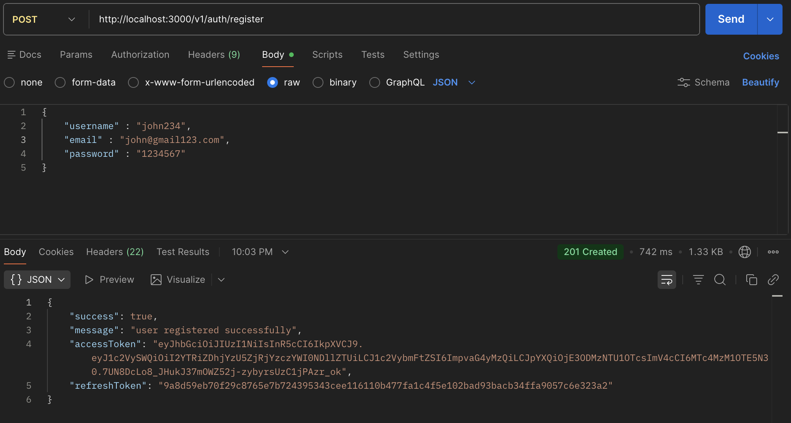
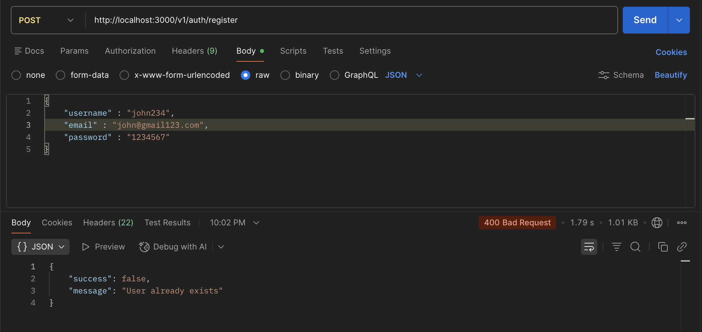
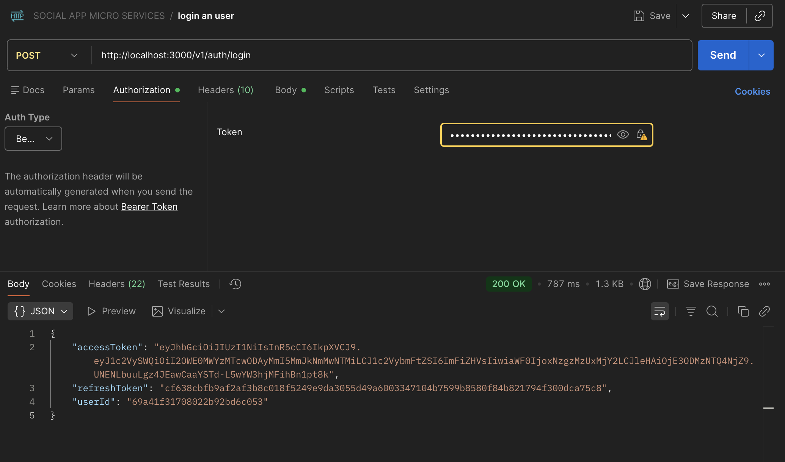
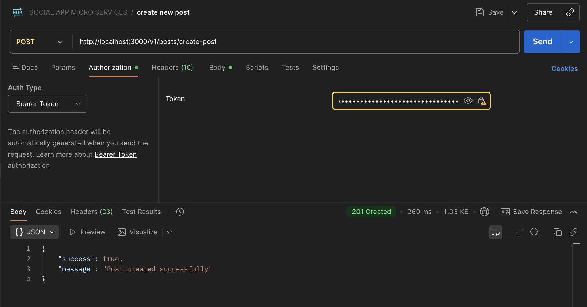
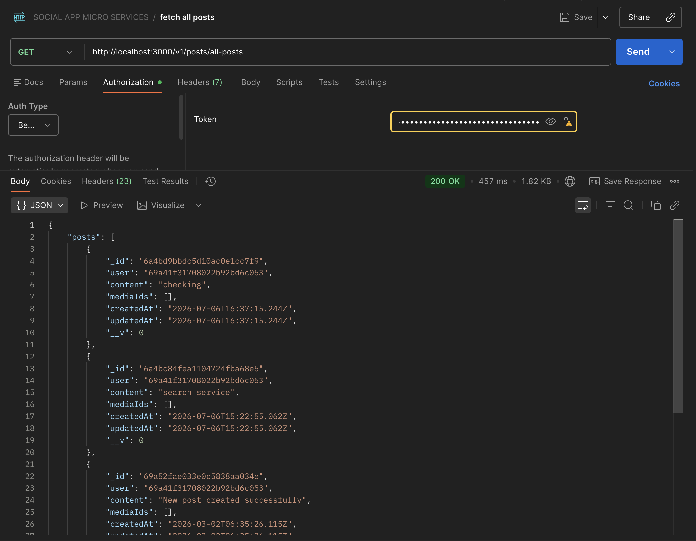
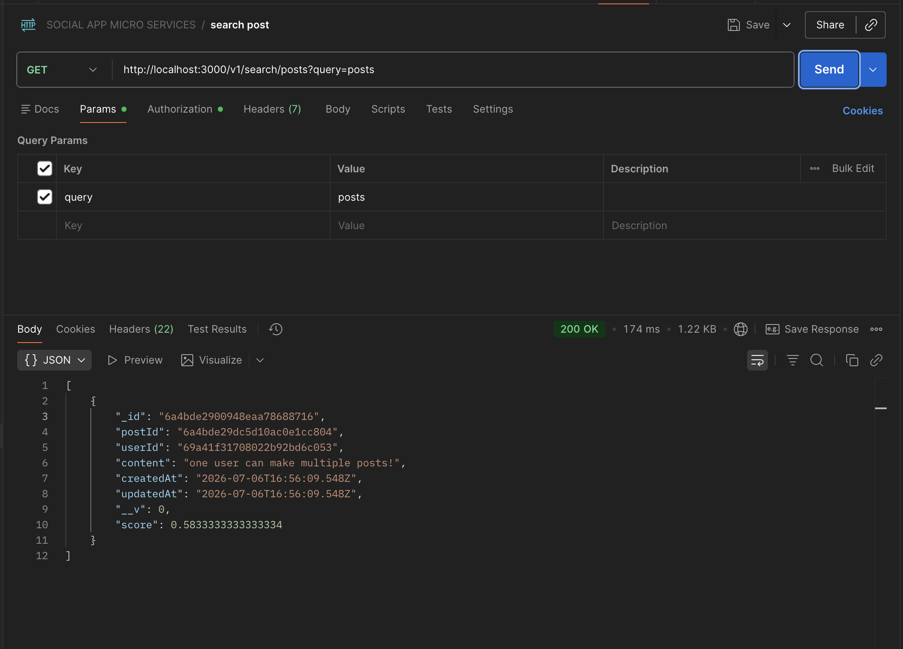
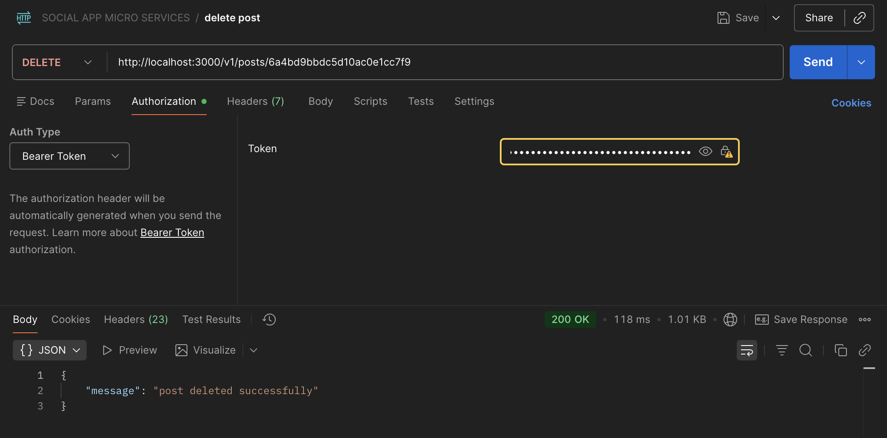
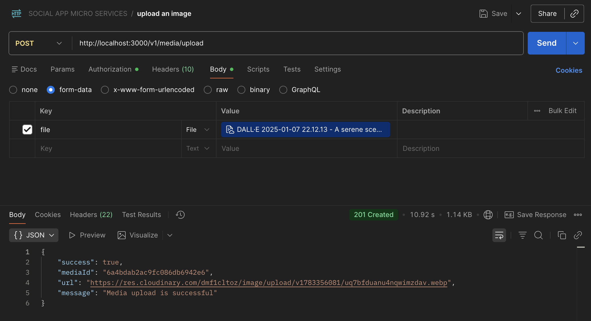
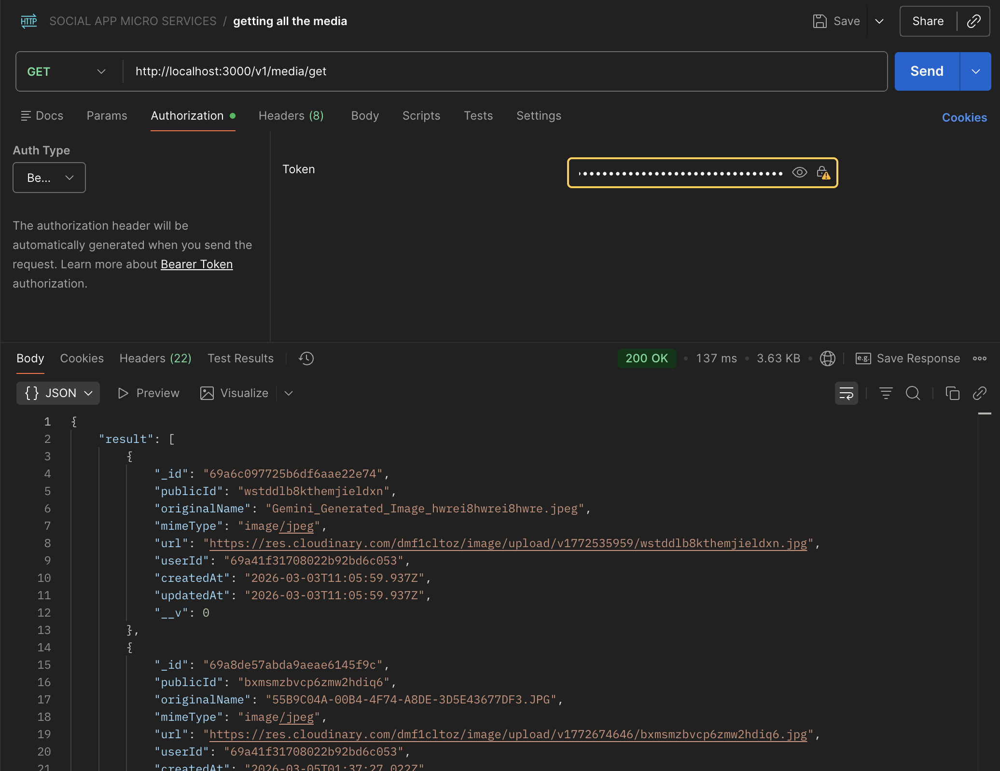
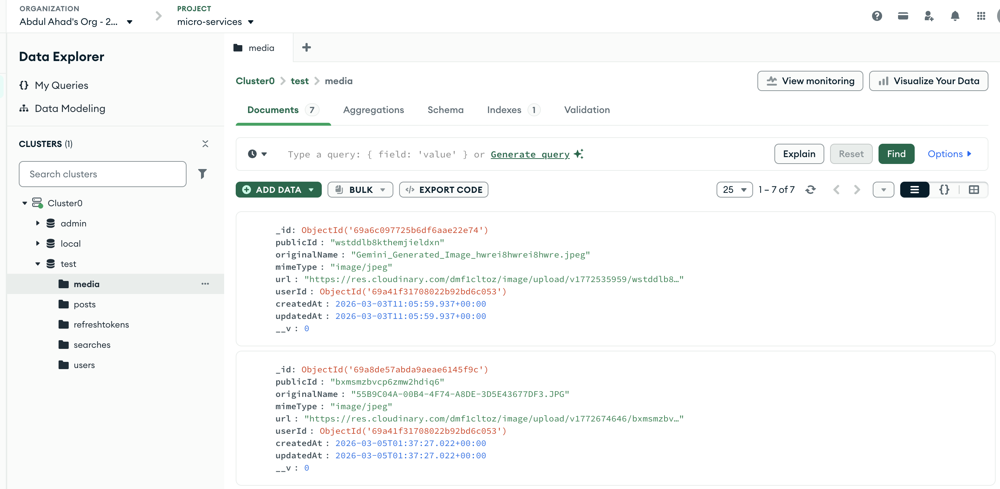

# 🌐 Distributed Social Media Backend

A production-style, event-driven microservices backend for a social
media platform --- built to explore real distributed-systems problems:
service decoupling, caching, rate limiting, and fault isolation.


:::

---

## 📖 Overview

This project implements a social media backend as **4 independently
deployable microservices** behind a single **API Gateway**,
communicating asynchronously via **RabbitMQ** and using **Redis** for
both caching and distributed rate limiting. Each service owns its own
MongoDB database (database-per-service pattern), so services can be
developed, deployed, and scaled independently.

It was built to go deep on questions that don't come up in a monolith:
_How do services talk to each other without being tightly coupled? How
do you rate-limit fairly across multiple instances? How do you cache
safely when writes happen in a different service than reads?_

---

## 🏗️ Architecture

                                  ┌────────────┐
                                  │   Client   │
                                  └─────┬──────┘
                                        │  HTTP
                                  ┌─────▼──────┐
                                  │ API Gateway│◄──────────┐
                                  │  (JWT auth)│           │
                                  └─────┬──────┘           │
                  ┌──────────────┬─────┴──────┬──────────────┐
                  │              │             │              │
            ┌─────▼────┐   ┌─────▼────┐  ┌─────▼────┐   ┌─────▼────┐
            │ Identity │   │   Post   │  │  Media   │   │  Search  │
            │ Service  │◄──┼──────────┼──┘          │   │          │
            └─────┬────┘   └─────┬────┘  └─────┬────┘   └─────┬────┘
                  │              │             │              │
            ┌─────▼────┐   ┌─────▼────┐  ┌─────▼────┐   ┌─────▼────┐
            │ MongoDB  │   │ MongoDB  │  │ MongoDB  │   │ MongoDB  │
            │(identity)│   │  (post)  │  │ (media)  │   │ (search) │
            └──────────┘   └─────┬────┘  └──────────┘   └──────────┘
                                  │ publish
                            ┌─────▼─────┐
                            │ RabbitMQ  │
                            │ (Exchange)│
                            └─────┬─────┘
                            consume│consume
                           ┌───────┴───────┐
                      ┌────▼────┐     ┌────▼────┐
                      │  Media  │     │ Search  │
                      │ Service │     │ Service │
                      └─────────┘     └─────────┘

                            ┌───────────────┐
                            │     Redis     │
                            │ (Cache + Rate │
                            │    Limiting)  │
                            └───────┬───────┘
                        used by:    │
                  Gateway • Identity • Post

_Client requests flow top-down through the Gateway. Post-service writes
flow sideways into RabbitMQ, which Media and Search consume
independently --- so a slow Search index update never blocks a post
being created. Redis sits underneath the Gateway, Identity, and Post
services for rate limiting and caching (Media has no Redis usage; Search
has it scaffolded but not yet wired in)._

```{=html}
<details>
```

```mermaid
graph TD
    Client[Client / Postman] -->|HTTP| Gateway[API Gateway :3000]

    Gateway -->|JWT verify + proxy| Identity[Identity Service]
    Gateway -->|JWT verify + proxy| Post[Post Service]
    Gateway -->|JWT verify + proxy| Media[Media Service]
    Gateway -->|JWT verify + proxy| Search[Search Service]

    Identity -->|users, refresh tokens| MongoIdentity[(MongoDB - Identity)]
    Post -->|posts| MongoPost[(MongoDB - Post)]
    Media -->|media metadata| MongoMedia[(MongoDB - Media)]
    Search -->|search index| MongoSearch[(MongoDB - Search)]

    Media -->|uploads| Cloudinary[(Cloudinary CDN)]

    Post -.publish post.created / post.deleted.-> RabbitMQ{{RabbitMQ Exchange}}
    RabbitMQ -.consume.-> Media
    RabbitMQ -.consume.-> Search

    Gateway <-->|rate limit store| Redis[(Redis)]
    Identity <-->|rate limit store| Redis
    Post <-->|cache: feed & posts| Redis
```

```{=html}
</details>
```

**Request flow:** every request enters through the API Gateway, which
verifies the JWT and proxies to the correct downstream service. **Event
flow:** when a post is created or deleted, the Post service publishes an
event to a RabbitMQ exchange instead of calling Media/Search directly
--- those services consume the event independently, so a slow or down
Search service never blocks post creation.

---

## ⚙️ Tech Stack

---

Layer Technology

---

Runtime Node.js, Express.js

Database MongoDB (Mongoose) --- one database
per service

Messaging RabbitMQ (publish/subscribe,
exchange-based routing)

Caching & Rate Limiting Redis (`ioredis`,
`rate-limit-redis`,
`rate-limiter-flexible`)

Auth JWT (access + refresh tokens,
refresh-token rotation)

Media Storage Cloudinary

Containerization Docker, Docker Compose

CI/CD GitHub Actions

---

---

## 🧩 Services

---

Service Responsibility

---

**API Gateway** Single entry point, JWT
verification, request proxying,
global Redis-backed rate limiting

**Identity Service** Registration, login, logout,
refresh-token rotation, IP-based
rate limiting on sensitive routes

**Post Service** Create/read/delete posts,
Redis-cached reads, publishes post
lifecycle events

**Media Service** Media upload to Cloudinary,
consumes post-deletion events to
clean up orphaned media

**Search Service** Consumes post events to keep a
search index in sync

---

---

## 🔑 Key Design Decisions

- **Event-driven decoupling** --- Post service never calls
  Media/Search directly; it publishes events to RabbitMQ and lets
  consumers react independently. A downstream service being slow or
  offline doesn't block post creation.
- **Cache-aside pattern with invalidation** --- Post reads are cached
  in Redis (5-min TTL on feed pages, 1-hour on individual posts); the
  cache is explicitly invalidated on writes to avoid serving stale
  data.
- **Distributed rate limiting** --- Rate limit counters live in Redis
  rather than in-memory, so limits are enforced correctly even if a
  service runs multiple instances. Registration has a stricter,
  dedicated limiter to reduce abuse.
- **Refresh-token rotation** --- Every refresh call invalidates the
  old refresh token and issues a new one, limiting the blast radius of
  a leaked token.
- **Database-per-service** --- Each service owns its own MongoDB
  database and connection string, avoiding cross-service coupling at
  the data layer.

---

## 📡 API Endpoints

```{=html}
<details>
```

```{=html}
<summary>
```

`<strong>`{=html}Identity Service`</strong>`{=html} ---
`<code>`{=html}/api/auth`</code>`{=html}

```{=html}
</summary>
```

---

Method Endpoint Description

---

POST `/register` Register a new user
(rate-limited: 50 req /
15 min per IP)

POST `/login` Authenticate and
receive access +
refresh tokens

POST `/refresh-token` Rotate refresh token,
issue new access token

POST `/logout` Invalidate refresh
token

---

```{=html}
</details>
```

```{=html}
<details>
```

```{=html}
<summary>
```

`<strong>`{=html}Post Service`</strong>`{=html} ---
`<code>`{=html}/api/posts`</code>`{=html}

```{=html}
</summary>
```

---

Method Endpoint Description

---

POST `/create-post` Create a new post
(publishes
`post.created` event)

GET `/all-posts` Paginated feed
(Redis-cached, 5-min
TTL)

GET `/:id` Single post by ID
(Redis-cached, 1-hour
TTL)

DELETE `/:id` Delete a post
(publishes
`post.deleted` event)

---

```{=html}
</details>
```

```{=html}
<details>
```

```{=html}
<summary>
```

`<strong>`{=html}Media Service`</strong>`{=html} ---
`<code>`{=html}/api/media`</code>`{=html}

```{=html}
</summary>
```

Method Endpoint Description

---

POST `/upload` Upload media to Cloudinary
GET `/get` Retrieve media metadata

```{=html}
</details>
```

```{=html}
<details>
```

```{=html}
<summary>
```

`<strong>`{=html}Search Service`</strong>`{=html} ---
`<code>`{=html}/api/search`</code>`{=html}

```{=html}
</summary>
```

Method Endpoint Description

---

GET `/posts` Search posts by indexed content

```{=html}
</details>
```

---

## 🚀 Getting Started

### Prerequisites

- Docker & Docker Compose
- MongoDB Atlas connection string (or local MongoDB)
- Cloudinary account (for media uploads)

### Setup

```bash
# 1. Clone the repository
git clone https://github.com/Ahadx488/social-media-microservices.git
cd social-media-microservices

# 2. Copy the example env file in each service and fill in your own values
cp api-gateway/.env.example api-gateway/.env
cp identity-services/.env.example identity-services/.env
cp post-service/.env.example post-service/.env
cp media-service/.env.example media-service/.env
cp search-service/.env.example search-service/.env
#    Fill in your MongoDB Atlas URI, JWT secret, and Cloudinary credentials in each

# 3. Build and run all services
docker-compose up -d --build

# 4. Confirm everything is running
docker-compose ps
```

The API Gateway will be available at `http://localhost:3000`. Redis and
RabbitMQ run as internal containers and don't need separate setup.

---

## 🧪 Testing & Verification

This project was tested locally using **Postman** for API requests and
**MongoDB Atlas** for verifying persisted data across services.

**Redis caching impact (measured in Postman):**

Metric Without Redis With Redis

---

Avg. response time (`/all-posts`) \~230ms \<100ms

```{=html}
<!--
📸 SCREENSHOT PLACEHOLDER: Postman
Add screenshots here showing:
  - A successful request/response cycle (e.g., POST /register or POST /login)
  - The Redis cache latency comparison (before/after)
Example:


-->
```

```{=html}
<!--
📸 SCREENSHOT PLACEHOLDER: MongoDB Atlas
Add screenshots here showing:
  - Each service's database/collection (e.g., identity-db.users, post-db.posts)
  - A sample document to show schema in practice
Example:

-->
```

---

## 📸 Screenshots

### 🏗️ Architecture


### 🔐 Identity Service

#### Register New User



#### Existing User Registration



#### Login



### 📝 Post Service

#### Create Post



#### Fetch All Posts



#### Search Posts



#### Delete Post



### 🖼️ Media Service

#### Upload Image to Cloudinary



#### Fetch Uploaded Media



### 🗄️ Database per Service



## 🔄 CI/CD

A GitHub Actions workflow (`.github/workflows/deploy.yml`) automates
building and pushing Docker images on every push, and deploys via SSH to
a VPS running Docker Compose.

```{=html}
<!--
📸 SCREENSHOT PLACEHOLDER: GitHub Actions
Add a screenshot of a successful workflow run here.
Example:

-->
```

---

## 📂 Project Structure

    social-media-microservices/
    ├── api-gateway/          # Entry point, JWT verification, proxying, rate limiting
    ├── identity-services/     # Auth: register, login, refresh, logout
    ├── post-service/          # Post CRUD, Redis caching, event publishing
    ├── media-service/         # Cloudinary uploads, event consumption
    ├── search-service/        # Search index, event consumption
    ├── .github/workflows/     # CI/CD pipeline
    └── docker-compose.yml     # Orchestrates all services + Redis + RabbitMQ

---

## 🛣️ Future Enhancements

- [ ] Redis caching in Search service (currently scaffolded, not yet
      implemented)
- [ ] Notification service for real-time post/interaction alerts
- [ ] Kubernetes deployment for production-grade orchestration
- [ ] Centralized service discovery and health monitoring

---

## 👤 Author

**Momin Abdul Ahad** 📧 amomin4848@gmail.com 🔗 [GitHub ---
Ahadx488](https://github.com/Ahadx488)

```{=html}
</div>
```
